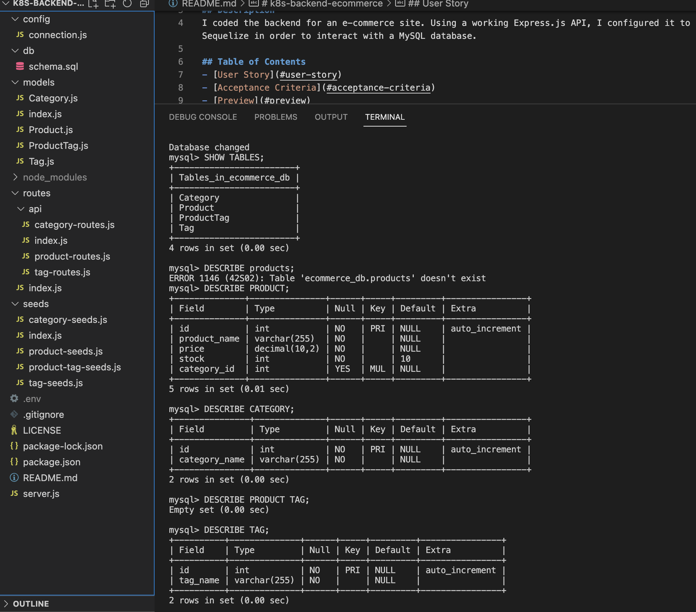

# k8s-backend-ecommerce

## Description
I coded the backend for an e-commerce site. Using a working Express.js API, I configured it to use Sequelize in order to interact with a MySQL database.

## Table of Contents
- [User Story](#user-story)
- [Acceptance Criteria](#acceptance-criteria)
- [Preview](#preview)
- [Demo](#demo)
- [Resources](#resources)
- [License](#license)

## User Story
AS A manager at an internet retail company

I WANT a back end for my e-commerce website that uses the latest technologies

SO THAT my company can compete with other e-commerce companies

## Acceptance Criteria
GIVEN a functional Express.js API

WHEN I add my database name, MySQL username, and MySQL password to an environment variable file

THEN I am able to connect to a database using Sequelize

WHEN I enter schema and seed commands

THEN a development database is created and is seeded with test data

WHEN I enter the command to invoke the application

THEN my server is started and the Sequelize models are synced to the MySQL database

WHEN I open API GET routes in Insomnia Core for categories, products, or tags

THEN the data for each of these routes is displayed in a formatted JSON

WHEN I test API POST, PUT, and DELETE routes in Insomnia Core

THEN I am able to successfully create, update, and delete data in my database

## Preview
Preview of application:
TODO: INSERT PHOTOS HEREEEEEE

since the application is unfinished, here is a screenshot of the tables made using sql shell commands. 

## Demo
TODO: INSERT VIDEO HEREEEEEE

## Resources:
[I started by cloning this starter code to my local machine.](https://github.com/coding-boot-camp/fantastic-umbrella) 

## License:
  
[License](./LICENSE)
This application is covered under the [MIT License](./LICENSE) license.